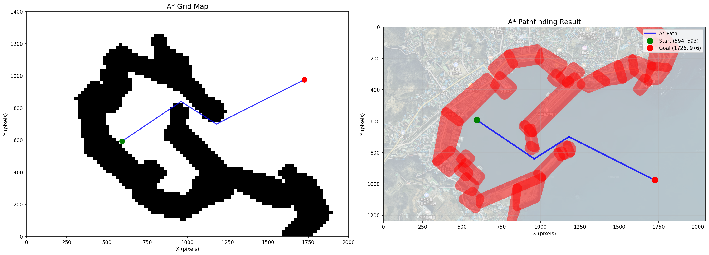
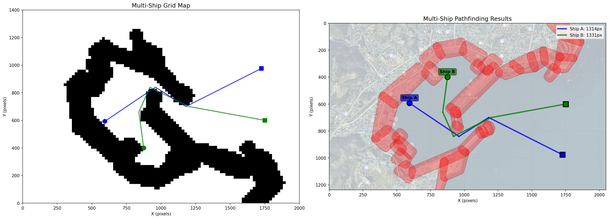

# 🚢 Awesome Ship Navigator

A* Algorithm-based Ship Navigation System with Obstacle Avoidance

## Overview

This is a **basic pathfinding implementation** using the A* algorithm for ship navigation. It provides collision-free path planning with a safety buffer around obstacles.

## ✨ Features

- **A* Grid-based Pathfinding**: Custom implementation for reliable obstacle avoidance
- **Safety Buffer**: 30-pixel safety margin around all obstacles
- **Multi-Ship Support**: Simultaneous path planning for multiple vessels
- **Path Smoothing**: Optimized waypoints for cleaner routes
- **Visual Output**: Dual visualization showing grid map and actual paths

## 🚀 Quick Start

### Installation

```bash
# Clone the repository
git clone https://github.com/stpcoder/awesome-ship-navigator.git
cd awesome-ship-navigator

# Create virtual environment
python3 -m venv venv
source venv/bin/activate  # On Windows: venv\Scripts\activate

# Install dependencies
pip install -r requirements.txt
```

### Basic Usage

#### Single Ship Navigation
```bash
python astar_pathfinder.py
```

#### Multiple Ships Navigation
```bash
python multi_ship_pathfinder.py
```

## 📊 Example Results

### Single Ship Pathfinding


The algorithm successfully finds an optimal path from start (green) to goal (red) while avoiding all obstacles (shown in red with safety buffer).

### Multi-Ship Pathfinding


Multiple ships navigate simultaneously with independent path calculations, each finding collision-free routes.

## 🛠️ Technical Details

### A* Algorithm Implementation

The system uses a grid-based A* algorithm with:
- **Grid Resolution**: 20x20 pixel cells
- **Safety Buffer**: 30 pixels around obstacles
- **8-directional Movement**: Diagonal moves supported
- **Path Smoothing**: Post-processing to remove unnecessary waypoints

### Key Components

```python
class AStarPathfinder:
    def __init__(self, width=2000, height=1400, grid_size=20, safety_buffer=30):
        # Initialize grid-based pathfinding

    def find_path(self, start, goal):
        # A* algorithm with safety buffer consideration

    def smooth_path(self, path):
        # Remove unnecessary waypoints
```

## 📁 Project Structure

```
awesome-ship-navigator/
│
├── astar_pathfinder.py              # Single ship A* implementation
├── multi_ship_pathfinder.py         # Multi-ship navigation
├── guryongpo_obstacles_drawn.json   # Obstacle data (34 polygons)
├── nn.png                           # Background harbor map
├── requirements.txt                 # Python dependencies
└── README.md                        # This file
```

## 🔧 Configuration

### Obstacle Data Format
Obstacles are defined in `guryongpo_obstacles_drawn.json`:
```json
[
  {
    "polygon": [[x1, y1], [x2, y2], [x3, y3], [x4, y4]]
  }
]
```

### Parameters
- **Map Size**: 2000x1400 pixels
- **Grid Size**: 20 pixels
- **Safety Buffer**: 30 pixels
- **Start Point**: Customizable (default: 594, 593)
- **Goal Point**: Customizable (default: 1726, 976)

## 📈 Performance

- **Path Quality**: Near-optimal paths with safety guarantees
- **Computation Time**: <1 second for single ship
- **Memory Usage**: Efficient grid representation
- **Scalability**: Supports multiple ships simultaneously

## 🎯 Use Cases

- Harbor traffic management
- Autonomous vessel navigation
- Maritime collision avoidance
- Port logistics optimization

## ⚠️ Limitations

- Fixed grid resolution (can be adjusted)
- Static obstacles only (no dynamic obstacle support yet)
- 2D navigation (no depth/altitude consideration)

## 🚧 Future Improvements

- [ ] Dynamic obstacle support
- [ ] Real-time path recalculation
- [ ] Time-based scheduling for collision avoidance
- [ ] Integration with real harbor data
- [ ] Web-based visualization interface

## 📝 License

MIT License

## 🤝 Contributing

Issues and Pull Requests are welcome!

---

**Note**: This is the most stable and well-tested version of the pathfinding algorithm. It has been validated with real harbor obstacle data and successfully handles complex polygon obstacles.