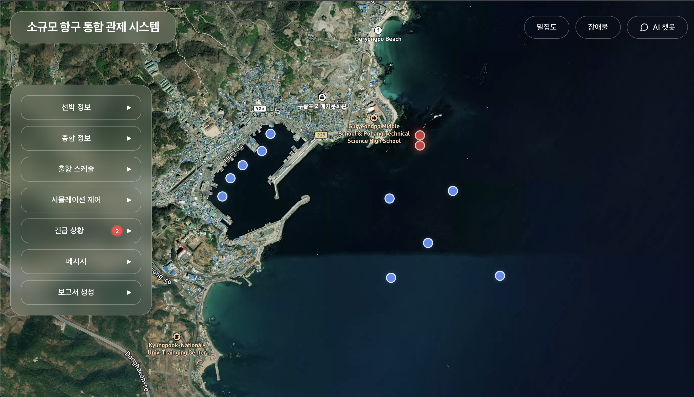
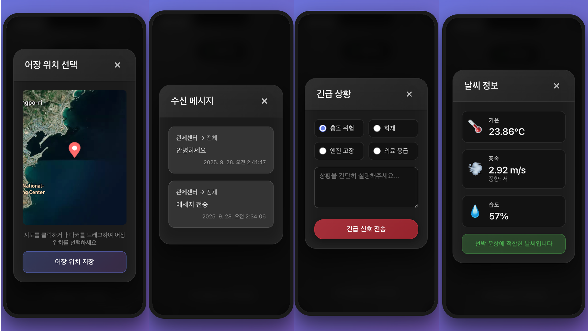
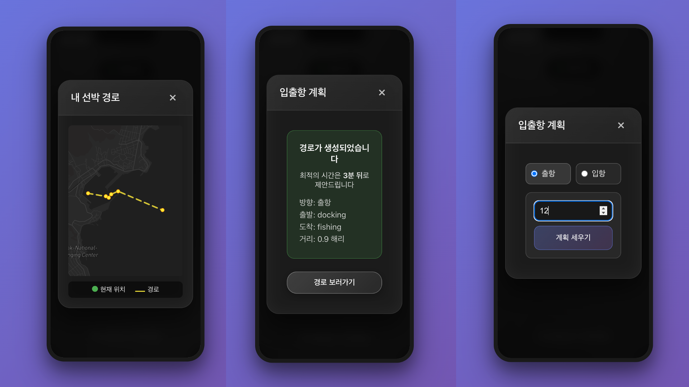

# 🚢 Awesome Ship Navigator

실시간 선박 관리 및 항해 최적화 시스템

## 📋 발표 자료

### 📄 프로젝트 발표서
**[선박_해커톤.pdf](선박_해커톤.pdf)** - 프로젝트 상세 발표 자료 다운로드

### 🎥 데모 영상
<div align="center">

#### 🎬 프로젝트 데모 영상
[](https://youtu.be/ZPkliuqTGSc)

**[▶️ 영상 보러가기](https://youtu.be/ZPkliuqTGSc)**

*실시간 선박 관리 시스템의 주요 기능을 소개하는 데모 영상입니다.*

</div>

---

## 📋 목차
- [스크린샷](#-스크린샷)
- [빠른 실행](#-빠른-실행-가이드)
- [주요 기능](#-주요-기능)
  - [대시보드](#1-대시보드-dashboard)
  - [AI 챗봇](#2-ai-챗봇-assistant)
- [기술 스택](#-기술-스택)
- [API 문서](#-api-문서)

---

## 📸 스크린샷

### 💻 데스크톱 화면

#### 메인 대시보드

*실시간 선박 위치 추적 및 지도 모니터링*

#### 시뮬레이션 실행

*선박 경로 시뮬레이션 및 시간 제어*

#### AI 챗봇

*음성 인식 기반 AI 챗봇 인터페이스*

#### 경로 계획

*충돌 회피 알고리즘 기반 경로 최적화*

#### 센서 데이터

*CCTV 및 LiDAR 센서 데이터 모니터링*

---

### 📱 모바일 화면

#### 모바일 대시보드

*반응형 디자인 - 모바일 최적화 대시보드*

#### 모바일 챗봇

*모바일 음성 인식 챗봇*

#### 모바일 지도

*터치 기반 지도 인터페이스*

---

## 🚀 빠른 실행 가이드

### 1️⃣ 데이터베이스 설정 (필수)
```bash
# 프로젝트 디렉토리로 이동
cd awesome-ship-naivgator

# 데이터베이스 초기화 (처음 한 번만)
./setup_database.sh
# 또는 수동으로:
# sqlite3 ship_routes.db < ship_routes_init.sql
```
✅ 데이터베이스 파일: `ship_routes.db` (191줄의 SQL 덤프에서 생성)

**⚠️ 중요**:
- **절대 `init_all_data.py`를 실행하지 마세요!**
- 데이터베이스는 이미 `ship_routes.db` 파일로 제공됩니다
- Git에서 클론 후 바로 사용 가능합니다

### 2️⃣ Backend 실행 (Python + FastAPI)
```bash
# Python 가상환경 생성 및 활성화
python3 -m venv venv
source venv/bin/activate  # Windows: venv\Scripts\activate

# 의존성 설치
pip install -r requirements.txt

# 환경 변수 설정
cp .env.example .env
# .env 파일에서 OPENAI_API_KEY 등 필수 키 설정

# 서버 실행
python app.py
```
✅ Backend: http://localhost:8000
📚 API Docs: http://localhost:8000/docs

### 3️⃣ Frontend 실행 (React)
```bash
# Frontend 디렉토리로 이동 (새 터미널)
cd awesome-ship-naivgator/frontend

# 의존성 설치
npm install

# 개발 서버 실행
npm start
```
✅ Frontend: http://localhost:3000

---

## ✨ 주요 기능

### 1. 대시보드 (Dashboard)

#### 🗺️ 실시간 지도 모니터링
- **선박 위치 추적**: 실시간 선박 위치 및 이동 경로 시각화
- **Live/Demo 모드**:
  - **Live**: 실제 EUM API 데이터 연동
  - **Demo**: 시뮬레이션 데이터로 테스트
- **지도 컨트롤**:
  - 줌 인/아웃
  - 선박 선택 및 정보 확인
  - 경로 표시/숨김

#### 📊 센서 데이터 모니터링
- **CCTV 영상**:
  - 8개 CCTV 장치 실시간 스트리밍
  - 지도상 CCTV 위치 마커 표시
  - 선택한 CCTV 영상 팝업 재생

- **LiDAR 통계**:
  - 5개 LiDAR 센서 데이터
  - 선박 밀도 및 장애물 감지
  - 히트맵 시각화

#### 🚢 선박 정보 패널
- **기본 정보**: 선박명, 유형, 속도, 방향
- **현재 위치**: 위도/경도 좌표
- **상태 정보**: 운항 상태, 목적지
- **센서 연동**: 선박별 센서 데이터 연결

#### 📍 경로 계획 (Route Planning)
- **시작/도착 지점 설정**: 지도 클릭으로 위치 지정
- **최적 경로 계산**: A* 알고리즘 기반 경로 최적화
- **충돌 회피**:
  - 장애물 자동 회피
  - 다른 선박과의 충돌 방지
  - 안전 거리 0.5해리 유지
- **경로 시뮬레이션**:
  - 시간별 위치 미리보기
  - 예상 도착 시간 계산

#### 🕐 시간 제어
- **시뮬레이션 재생/일시정지**
- **속도 조절**: 1x, 2x, 4x 배속
- **특정 시간대 이동**: 타임라인 슬라이더

#### 🆘 긴급 상황 관리
- **SOS 알림**: 실시간 긴급 신호 수신
- **긴급 메시지**: 선박별 긴급 상황 전파
- **위치 기반 알림**: 지도상 SOS 마커 표시

#### 💬 메시지 센터
- **선박간 통신**: 실시간 메시지 송수신
- **읽지 않은 메시지 카운트**
- **선박별 메시지 필터링**
- **알림 시스템**: 새 메시지 팝업 알림

#### 📈 밀도 히트맵
- **선박 밀도 시각화**: 구역별 선박 집중도 표시
- **그래디언트 컬러맵**:
  - 낮은 밀도 (파랑) → 높은 밀도 (빨강)
- **입출항 통계**: 구역별 선박 통행량 분석

#### 📝 보고서 생성
- **항해 보고서**:
  - 선박별 운항 기록
  - 경로 이력
  - 이벤트 로그
- **PDF 내보내기**: 보고서 다운로드
- **통계 분석**:
  - 평균 속도
  - 총 운항 거리
  - 정박 시간

---

### 2. AI 챗봇 (Assistant)

#### 🎤 음성 인식 (Voice Recognition)
- **한국어 음성 인식**: Web Speech API 활용
- **실시간 텍스트 변환**: 음성 → 텍스트 자동 변환
- **음성 레벨 표시**: 마이크 입력 시각화
- **자동 침묵 감지**: 말이 끝나면 자동 종료

#### 🤖 AI 대화 기능
- **OpenAI GPT 연동**: 자연어 이해 및 응답
- **선박별 맞춤 대화**: 선택한 선박 컨텍스트 반영
- **실시간 응답**: 빠른 답변 생성

#### 🛠️ 기능별 모달 (Function Modals)

##### ⏰ 출항 시간 추천
- **두 가지 모드**:
  - **수용 O (Flexible)**: AI가 최적 시간 추천
  - **수용 X (Fixed)**: 사용자 지정 시간 사용
- **충돌 회피 계산**: 다른 선박과의 충돌 시간 예측
- **비용 최적화**: 지연 vs 우회 비용 비교

##### 📋 항해 계획 전송
- **목적지 설정**: 위도/경도 입력
- **계획 확정**: 선박에 항해 계획 전송
- **실시간 동기화**: 대시보드와 연동

##### 🗺️ 경로 표시
- **현재 경로 조회**: 선박의 현재 항로 표시
- **웨이포인트 리스트**: 경유지 좌표 목록
- **지도 오버레이**: 경로를 지도에 오버레이

##### 🌤️ 날씨 정보
- **현재 날씨**: 위치별 날씨 데이터
- **예보 정보**: 시간대별 날씨 예측
- **해상 정보**: 파고, 풍속 등

##### 🆘 SOS 신호 발송
- **긴급 신호 전송**: 즉시 SOS 전파
- **위치 정보 포함**: 현재 위치 자동 전송
- **우선순위 처리**: 긴급 메시지 최우선 표시

##### 🎣 조업 구역 설정
- **어업 구역 지정**: 조업할 해역 설정
- **금지 구역 확인**: 조업 금지 구역 체크
- **구역 저장**: 설정 저장 및 공유

##### ⚓ 정박 위치 설정
- **정박지 지정**: 선박 정박 위치 설정
- **안전 거리 확인**: 다른 선박과의 간격 체크
- **정박 시간 설정**: 정박 시작/종료 시간

##### 📜 기능 목록
- **사용 가능한 명령어**: 챗봇 기능 전체 목록
- **도움말**: 각 기능별 사용법
- **예시 대화**: 샘플 음성 명령어

##### 💬 메시지 수신
- **읽지 않은 메시지**: 새 메시지 확인
- **메시지 히스토리**: 과거 대화 내역
- **필터링**: 선박별, 날짜별 필터

##### 📤 메시지 전송
- **선박 선택**: 수신 선박 지정
- **메시지 작성**: 텍스트 메시지 입력
- **즉시 전송**: 실시간 메시지 전달

#### 🚨 충돌 경고 시스템
- **자동 충돌 예측**:
  - 안전 거리 침범 감지 (0.5해리)
  - 충돌 예상 시간 계산
  - 위험도 평가
- **실시간 알림**:
  - 팝업 경고창
  - 위험 선박 정보 표시
  - 추천 회피 방안
- **중복 경고 방지**:
  - 이미 경고한 선박 추적
  - 스마트 알림 주기 조절

#### 🎯 음성 명령 예시
```
"선박 001의 출항 시간을 추천해줘"
"현재 경로를 보여줘"
"날씨 정보 알려줘"
"SOS 신호 보내줘"
"메시지 확인해줘"
"EUM003 선박에게 메시지 보내줘"
```

---

## 🛠️ 기술 스택

### Backend
- **Framework**: FastAPI + Uvicorn
- **Database**: SQLite (SQLAlchemy ORM)
- **AI/ML**: OpenAI GPT-4 API
- **Navigation**: A* Pathfinding, Pyvisgraph
- **Geospatial**: Shapely, Geopy
- **Data Processing**: NumPy, Matplotlib

### Frontend
- **Framework**: React 18
- **Mapping**: React-Leaflet (OpenStreetMap)
- **UI Components**: Custom CSS
- **HTTP Client**: Axios
- **Routing**: React Router v6
- **Voice**: Web Speech API

### Infrastructure
- **API Communication**: REST API
- **Real-time Updates**: Polling (5초 간격)
- **CORS**: Flask-CORS
- **Environment**: Python-dotenv

---

## 📚 API 문서

### 주요 API 엔드포인트

#### 선박 관리
```
GET  /api/ships              # 전체 선박 목록
GET  /api/ships/{id}          # 특정 선박 정보
POST /api/ships               # 선박 등록
PUT  /api/ships/{id}          # 선박 정보 수정
```

#### EUM API 연동
```
GET  /api/eum/ships           # EUM 선박 데이터
GET  /api/eum/ships/realtime/{mode}  # 실시간 위치 (live/demo)
GET  /api/eum/cctv            # CCTV 목록
GET  /api/eum/lidar           # LiDAR 목록
```

#### 경로 계획
```
POST /api/route/plan          # 경로 생성
GET  /api/route/{ship_id}     # 선박 경로 조회
POST /api/route/optimize      # 출항 시간 최적화
```

#### 시뮬레이션
```
POST /api/simulation/start    # 시뮬레이션 시작
POST /api/simulation/stop     # 시뮬레이션 중지
GET  /api/simulation/status   # 시뮬레이션 상태
GET  /api/simulation/ship-route/{ship_id}  # 시뮬레이션 경로
```

#### 메시지/알림
```
GET  /api/messages            # 메시지 목록
POST /api/messages            # 메시지 전송
GET  /api/messages/unread-count  # 읽지 않은 메시지 수
GET  /api/sos/active          # 활성 SOS 알림
POST /api/sos                 # SOS 신호 전송
```

#### AI 챗봇
```
POST /api/chatbot/process     # 음성/텍스트 처리
POST /api/chatbot/recommend-departure  # 출항 시간 추천
POST /api/chatbot/send-plan   # 항해 계획 전송
```

전체 API 문서: http://localhost:8000/docs (서버 실행 후)

---

## 📁 프로젝트 구조

```
awesome-ship-navigator/
│
├── app.py                       # FastAPI 메인 서버
├── chatbot_service.py           # AI 챗봇 서비스
├── core_optimizer_latlng.py     # 경로 최적화 엔진
├── database.py                  # 데이터베이스 설정
├── models.py                    # 데이터 모델
├── ship_routes.db              # SQLite 데이터베이스
├── requirements.txt            # Python 의존성
├── .env                        # 환경 변수 (API 키)
│
├── frontend/
│   ├── src/
│   │   ├── components/
│   │   │   ├── ChatBot.js          # AI 챗봇 UI
│   │   │   ├── MapViewReal.js      # 실시간 지도
│   │   │   ├── ShipInfo.js         # 선박 정보 패널
│   │   │   ├── SensorInfo.js       # 센서 데이터 패널
│   │   │   ├── FunctionModals.js   # 챗봇 기능 모달
│   │   │   ├── Emergency.js        # 긴급상황 관리
│   │   │   ├── Messages.js         # 메시지 센터
│   │   │   └── ReportGenerator.js  # 보고서 생성
│   │   ├── App.js                  # 메인 앱
│   │   ├── App.css                 # 스타일
│   │   └── data/
│   │       └── obstacles_latlng.json  # 장애물 데이터
│   ├── public/
│   └── package.json
│
└── README.md
```

---

## 🎯 주요 알고리즘

### 1. A* 경로 탐색
- **Grid-based Pathfinding**: 그리드 기반 최단 경로 탐색
- **Obstacle Avoidance**: 장애물 자동 회피
- **Safety Buffer**: 0.5해리 안전 거리 유지

### 2. 충돌 회피 최적화
```python
# 통합 비용 함수
Total Cost (분) = 출항 지연 시간 + 우회 시간
Detour Time = 추가 거리 (해리) / 속도 (노트) × 60
```

**최적화 전략**:
- 출항 시간 조정 (-30 ~ +120분)
- 대체 경로 생성 (회피 반경 조절)
- 최소 비용 솔루션 선택

### 3. 실시간 충돌 예측
- **안전 거리**: 0.5 nautical miles
- **시간 기반 위치 추적**
- **구간별 충돌 예측**

---

## ⚠️ 현재 제한사항

- 정적 장애물만 지원 (섬, 암초)
- 2D 항해 (수심 고려 안함)
- 항해 중 일정 속도 유지
- 기상/해류 영향 미반영

---

## 🚧 로드맵

- [ ] 동적 장애물 지원 (이동 선박)
- [ ] 실시간 경로 재계획
- [ ] 기상/해류 데이터 통합
- [ ] AIS 데이터 연동
- [ ] 모바일 앱 개발
- [ ] WebSocket 실시간 통신

---

## 🤝 기여하기 (Contributing)

Issues와 Pull Requests를 환영합니다!

1. Fork the Project
2. Create your Feature Branch (`git checkout -b feature/AmazingFeature`)
3. Commit your Changes (`git commit -m 'Add some AmazingFeature'`)
4. Push to the Branch (`git push origin feature/AmazingFeature`)
5. Open a Pull Request

---

## 📄 라이선스 (License)

MIT License

---

## 📞 문의 (Contact)

프로젝트 관련 문의는 Issues를 통해 남겨주세요.

---

## 🗄️ 데이터베이스 스키마

시스템은 SQLite 데이터베이스(`ship_routes.db`)를 사용하며, 다음 테이블들로 구성됩니다:

### 📊 주요 테이블

#### 1. `ships` - 선박 정보
```sql
CREATE TABLE ships (
    id INTEGER PRIMARY KEY,
    ship_id VARCHAR UNIQUE,          -- 선박 ID (예: EUM001)
    name VARCHAR,                     -- 선박명 (예: 해성호)
    type VARCHAR,                     -- 선박 유형 (어선, 화물선 등)
    pol VARCHAR,                      -- 출발항
    pol_addr VARCHAR,                 -- 출발항 주소
    length FLOAT,                     -- 선박 길이 (m)
    breath FLOAT,                     -- 선박 너비 (m)
    depth FLOAT,                      -- 선박 깊이 (m)
    gt FLOAT,                         -- 총톤수
    latitude FLOAT,                   -- 현재 위도
    longitude FLOAT,                  -- 현재 경도
    speed FLOAT,                      -- 속도 (노트)
    course FLOAT,                     -- 방향 (도)
    fishing_area_lat FLOAT,           -- 조업 구역 위도
    fishing_area_lng FLOAT,           -- 조업 구역 경도
    docking_lat FLOAT,                -- 정박 위치 위도
    docking_lng FLOAT,                -- 정박 위치 경도
    created_at DATETIME,
    updated_at DATETIME
);
```

#### 2. `ship_routes_simulation` - 시뮬레이션 경로
```sql
CREATE TABLE ship_routes_simulation (
    id INTEGER PRIMARY KEY,
    ship_id VARCHAR UNIQUE,           -- 선박 ID
    ship_name VARCHAR,                -- 선박명
    departure_time VARCHAR,           -- 출항 시간 (ISO 8601)
    arrival_time VARCHAR,             -- 도착 시간 (ISO 8601)
    path TEXT,                        -- 경로 좌표 (JSON)
    speed_knots FLOAT,                -- 속도 (노트)
    direction VARCHAR,                -- 방향
    created_at DATETIME
);
```

#### 3. `cctv_devices` - CCTV 장치
```sql
CREATE TABLE cctv_devices (
    id INTEGER PRIMARY KEY,
    name VARCHAR,                     -- CCTV 이름
    latitude VARCHAR,                 -- 위도
    longitude VARCHAR,                -- 경도
    address VARCHAR,                  -- 주소
    created_at DATETIME
);
```

#### 4. `lidar_devices` - LiDAR 장치
```sql
CREATE TABLE lidar_devices (
    id INTEGER PRIMARY KEY,
    name VARCHAR,                     -- LiDAR 이름
    latitude VARCHAR,                 -- 위도
    longitude VARCHAR,                -- 경도
    address VARCHAR,                  -- 주소
    created_at DATETIME
);
```

#### 5. `messages` - 메시지
```sql
CREATE TABLE messages (
    id INTEGER PRIMARY KEY,
    sender_id VARCHAR,                -- 발신자 ID
    sender_name VARCHAR,              -- 발신자 이름
    recipient_id VARCHAR,             -- 수신자 ID
    recipient_name VARCHAR,           -- 수신자 이름
    message TEXT,                     -- 메시지 내용
    message_type VARCHAR,             -- 메시지 유형
    is_read BOOLEAN,                  -- 읽음 여부
    created_at DATETIME,
    read_at DATETIME
);
```

#### 6. `sos_alerts` - SOS 알림
```sql
CREATE TABLE sos_alerts (
    id INTEGER PRIMARY KEY,
    ship_id VARCHAR,                  -- 선박 ID
    ship_name VARCHAR,                -- 선박명
    latitude FLOAT,                   -- 위도
    longitude FLOAT,                  -- 경도
    message TEXT,                     -- SOS 메시지
    status VARCHAR,                   -- 상태 (active/resolved)
    created_at DATETIME,
    resolved_at DATETIME
);
```

#### 7. `weather_data` - 날씨 데이터
```sql
CREATE TABLE weather_data (
    id INTEGER PRIMARY KEY,
    date VARCHAR UNIQUE,              -- 날짜
    temperature FLOAT,                -- 온도 (°C)
    wind_speed FLOAT,                 -- 풍속 (m/s)
    wind_direction FLOAT,             -- 풍향 (도)
    humidity FLOAT,                   -- 습도 (%)
    created_at DATETIME
);
```

### 🔄 데이터 초기화

#### 방법 1: SQL 덤프 사용 (권장)
```bash
sqlite3 ship_routes.db < ship_routes_init.sql
```

#### 방법 2: 자동 스크립트 사용
```bash
./setup_database.sh
```

#### 방법 3: 경로 재생성 (문제 발생 시)
```bash
# 시뮬레이션 경로 생성
python generate_ship_routes.py

# 또는 개별 선박 경로 생성
python generate_ship001_routes.py
```

### 📈 데이터 현황

초기 데이터베이스에는 다음이 포함됩니다:
- **선박**: 10개 (EUM001 ~ EUM010)
- **CCTV 장치**: 8개
- **LiDAR 장치**: 5개
- **시뮬레이션 경로**: 9개 (선박 2~10)
- **초기 메시지**: 0개 (사용자 생성)

---

**Version**: 5.0 | **Last Updated**: October 2024 | **Status**: Production Ready ✅